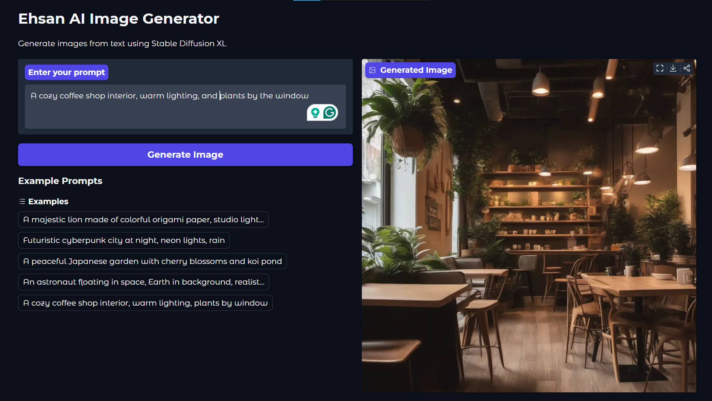

# 🎨 Ehsan AI Image Generator

An AI-powered text-to-image generator built with Stable Diffusion XL and Gradio, allowing users to create stunning images from text descriptions.


## 🌟 Features

- **Text-to-Image Generation**: Transform text prompts into high-quality images
- **User-Friendly Interface**: Clean, intuitive Gradio web interface
- **Pre-loaded Examples**: Quick-start prompts for inspiration
- **Real-time Status Updates**: Visual feedback on generation progress
- **Shareable Link**: Generate a public link to share your app

## 🛠️ Technologies Used

| Technology | Purpose |
|------------|---------|
| **Python** | Core programming language |
| **Gradio** | Web UI framework for ML applications |
| **Hugging Face Inference API** | Serverless AI model hosting |
| **Stable Diffusion XL** | State-of-the-art image generation model |
| **python-dotenv** | Environment variable management |

## 📋 Prerequisites

- Python 3.8 or higher
- Hugging Face account (free)
- Hugging Face API token

## 🚀 Installation

1. **Clone the repository**
```bash
git clone https://github.com/ehsanaiverse/ai-image-generator.git
cd ai-image-generator
```

2. **Create virtual environment** (recommended)
```bash
python -m venv venv
source venv/bin/activate  # On Windows: venv\Scripts\activate
```

3. **Install dependencies**
```bash
pip install -r requirements.txt
```

4. **Set up environment variables**

Create a `.env` file in the root directory:
```env
MODEL_ID=stabilityai/stable-diffusion-xl-base-1.0
HF_TOKEN=your_huggingface_token_here
```

To get your Hugging Face token:
- Go to [huggingface.co](https://huggingface.co)
- Sign up/Login → Settings → Access Tokens → Create new token

## 📁 Project Structure

```
ai-image-generator/
│
├── app/
│   ├── __init__.py
│   ├── config.py          # Configuration and environment variables
│   ├── model.py           # Hugging Face client initialization
│   ├── generator.py       # Image generation logic
│   └── ui.py              # Gradio interface design
│
├── main.py                # Application entry point
├── .env                   # Environment variables (not in repo)
├── requirements.txt       # Python dependencies
└── README.md             # Project documentation
```

## 💻 Usage

1. **Run the application**
```bash
python main.py
```

2. **Access the interface**
   - Local URL: `http://127.0.0.1:7860`
   - Public URL: Will be displayed in terminal (temporary, expires after 72 hours)

3. **Generate images**
   - Enter a descriptive prompt in the text box
   - Click "Generate Image"
   - Wait for the AI to create your image
   - Try example prompts for inspiration!

## 🎯 Example Prompts

- "A majestic lion made of colorful origami paper, studio lighting"
- "Futuristic cyberpunk city at night, neon lights, rain"
- "A peaceful Japanese garden with cherry blossoms and koi pond"
- "An astronaut floating in space, Earth in background, realistic"

## 🏗️ Architecture

```
User Input (Prompt)
       ↓
   Gradio UI (ui.py)
       ↓
Generator Function (generator.py)
       ↓
Hugging Face Client (model.py)
       ↓
Stable Diffusion XL API
       ↓
Generated Image → Display
```

## 🧠 How It Works

1. **User Interface**: Gradio creates an interactive web interface
2. **Prompt Processing**: User's text description is captured
3. **API Request**: Sent to Hugging Face Inference API
4. **Model Processing**: Stable Diffusion XL generates the image
5. **Result Display**: Image returned and displayed in the UI

## 🔒 Security Notes

- Never commit your `.env` file or API tokens to GitHub
- Add `.env` to `.gitignore`
- Use environment variables for sensitive data

## 🚧 Challenges & Solutions

| Challenge | Solution |
|-----------|----------|
| API rate limits | Implemented error handling and user feedback |
| Environment management | Used python-dotenv for secure config |
| User experience | Added example prompts and status updates |

## 🔮 Future Enhancements

- [ ] Add image resolution options
- [ ] Implement negative prompts
- [ ] Save generation history
- [ ] Multiple model selection
- [ ] Image-to-image transformation
- [ ] Batch generation
- [ ] Style presets

## 🤝 Contributing

Contributions are welcome! Please feel free to submit a Pull Request.


## 👨‍💻 Author

**Your Name**
- GitHub: [@ehsanaiverse](https://github.com/ehsanaiverse)
- Email: ehsanullah.contact@gmail.com

## 🙏 Acknowledgments

- [Hugging Face](https://huggingface.co) for the Inference API
- [Stability AI](https://stability.ai) for Stable Diffusion XL
- [Gradio](https://gradio.app) for the amazing UI framework

## 📸 Screenshots





---

⭐ If you found this project helpful, please give it a star!